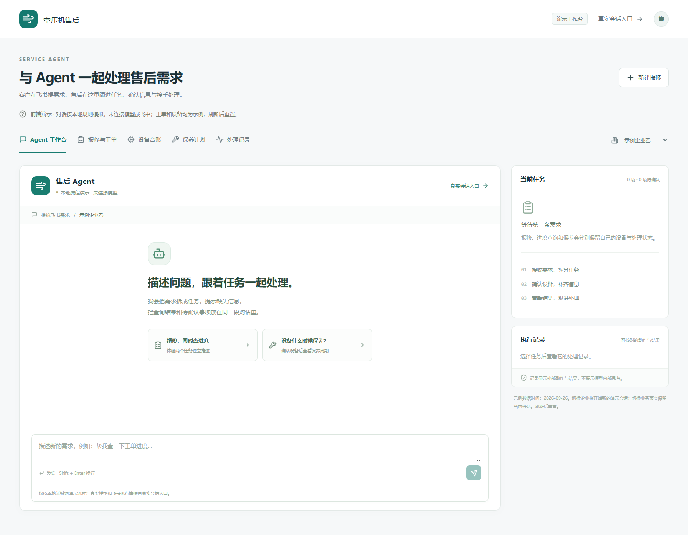
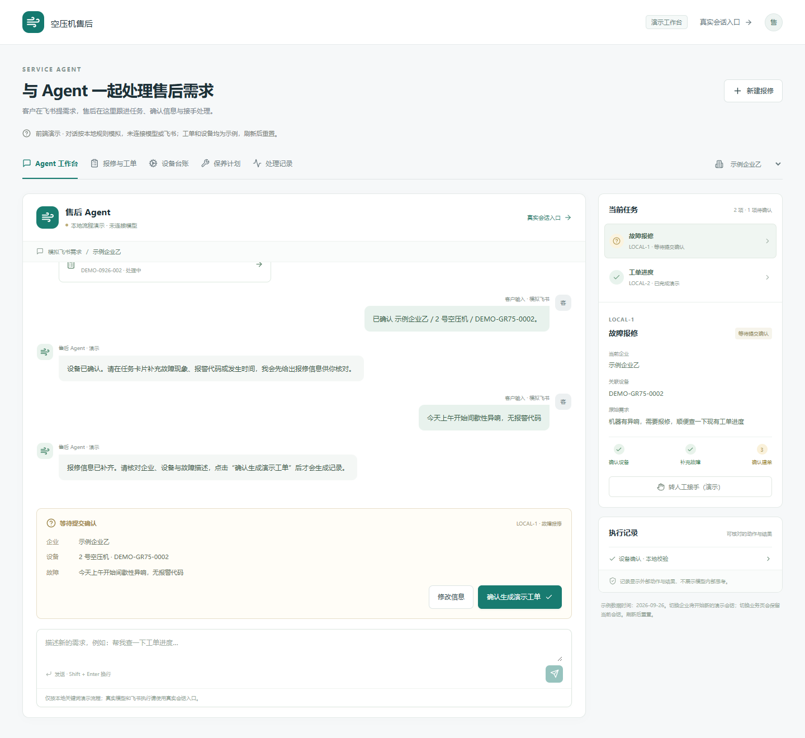
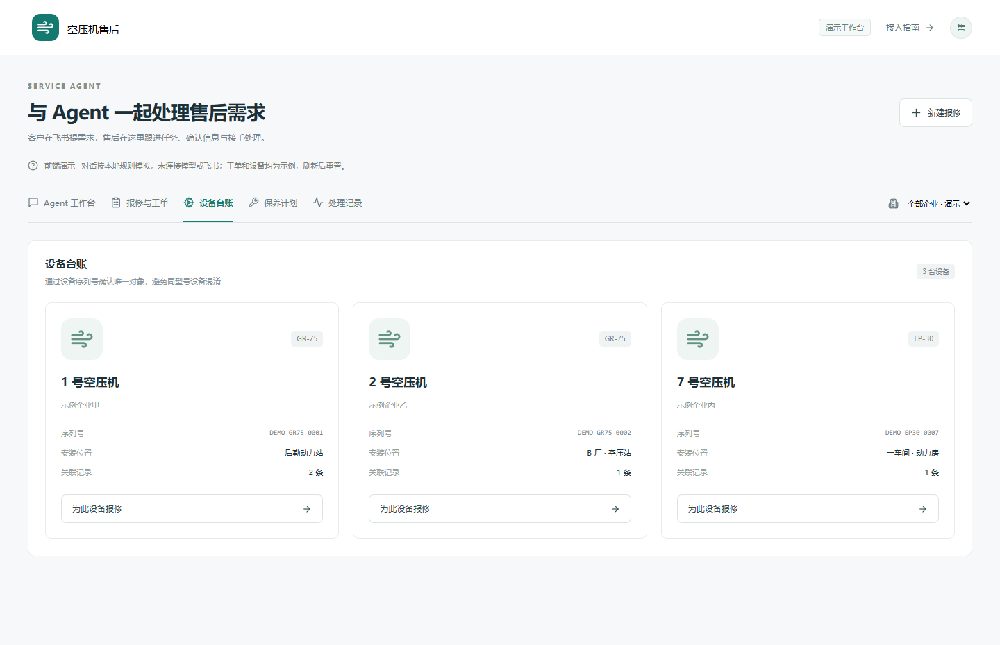
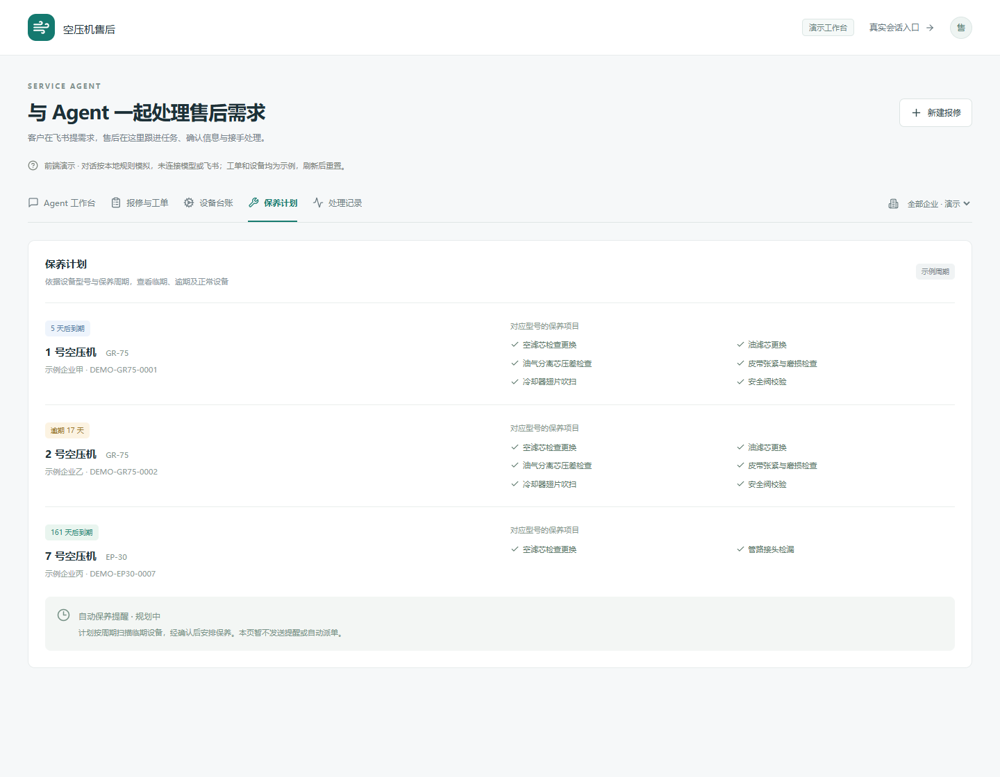
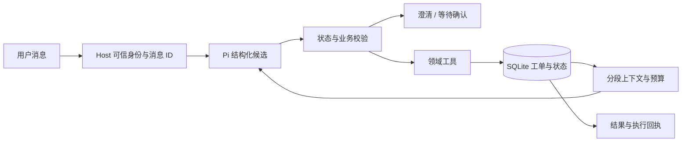

# 空压机售后 Agent

[](https://github.com/siye566/fengyun-service-agent/actions/workflows/verify.yml)


[](LICENSE)

**把报修、保养与进度查询接入受控的会话流程。** 提供可运行的售后业务引擎、持久化任务状态、企业隔离、上下文预算和离线流程 Benchmark。

这是脱敏业务原型。后端工具可以真实读写示例 SQLite；新售后界面使用内存演示数据。两者的接入方式与验证范围分别说明。

[快速体验](#快速体验) · [能力与源码](docs/implementation-map.md) · [Pi 接入](docs/run-service-mode.md) · [验证记录](docs/validation.md)

## 运行截图

以下截图来自实际本地运行，企业及设备均使用脱敏示例。前端画面保留“演示”标识，后端运行记录单独展示。

**售后工作台 · 前端演示**



<details>
<summary>报修确认：补充设备与故障，核对后再提交</summary>

前端演示将报修与进度查询分开保留。此图为等待确认状态，按钮生成的是组件内存中的演示工单。



</details>

<details>
<summary>设备台账与保养计划</summary>

设备用 DEMO 编号区分；保养页展示临期、逾期和正常状态，以及型号对应项目。页面内的自动提醒标注为规划中。





</details>

<details>
<summary>后端实际运行：等待确认 → 独立查询 → 确认建单</summary>

以下是 `python scripts/demo_service.py` 的真实 stdout 整理视图，运行时读写临时 SQLite。它是运行记录展示，不是后台产品界面；未调用模型或发送飞书消息。


</details>

截图复现方式见 [截图说明](docs/screenshots/README.md)。

## 一条报修链路

```text
“报修 DEMO-GR75-0001 异响” → 校验身份与设备 → 等待用户确认
“查工单进度”              → 独立只读查询 → 原报修继续等待
“确认报修”                → 校验可信原文 → 创建工单并保存回执
重复收到同一确认消息       → 返回原结果   → 不重复建单
```

程序决定作用域、确认条件和写操作；模型提供意图及实体候选。待确认状态保存到数据库，设备不明确、字段缺失、跨企业访问或上下文超限时有明确失败路径。

## 能力地图

| 模块 | 当前实现 | 源码入口 |
| --- | --- | --- |
| 意图与状态路由 | 结构化候选校验、缺字段澄清、确认建单、查询不覆盖待处理报修 | [service.py](acs-agent/acs/service.py) |
| 企业隔离 | 可信会话绑定、默认拒绝、设备/工单归属校验、绑定变更隔离旧任务 | [identity.py](acs-agent/acs/identity.py) |
| 上下文与预算 | 6 段按阶段装配，来源/摘要/哈希审计，字节预算、告警与阻断 | [context.py](acs-agent/acs/context.py) |
| 业务工具 | 报修、保养、进度、保养扫描、零件申领和内部审批 | [tools.py](acs-agent/acs/tools.py) |
| Runtime 接入 | Node→Python CLI，可信原文和事件 ID 注入，当前 Pi 入口的上下文检查 | [acs-tools.ts](miniclaw/container/agent-runner/src/acs-tools.ts) |
| 流程 Benchmark | 16 个场景，标注意图、澄清、允许工具、目标状态及工单数 | [service_cases.json](acs-agent/evals/service_cases.json) |
| 售后工作台 | 对话、设备确认、任务与工单演示 | [前端说明](miniclaw/web/SERVICE-FRONTEND.md) |



## 快速体验

### 后端：无需模型密钥

需要 Python 3.10+。下面的 demo 和 Benchmark 都创建临时数据库，退出后自动清理。

```bash
git clone https://github.com/siye566/fengyun-service-agent.git
cd fengyun-service-agent/acs-agent
python -m venv .venv
# Windows: .venv\Scripts\activate
# macOS/Linux: source .venv/bin/activate
python -m pip install pytest
python scripts/demo_service.py
python -m pytest -q
python evals/run_service_eval.py --output evals/reports/service.json
```

接入模型/MCP 时再安装 `requirements.txt`。真实 Pi 链路须启用 `ACS_SERVICE_MODE=1` 并绑定实际会话身份，完整步骤见 [运行指南](docs/run-service-mode.md)。

### 前端：售后交互预览

需要 Node.js 20+。先在 `miniclaw` 下执行 `npm ci`，再运行：

```bash
cd miniclaw/web
npm ci
npm run dev
```

打开 `http://localhost:5173/service-preview`。前端确认、任务和执行记录使用内存数据，刷新后重置；这些按钮还没有接入上述业务引擎。真实会话工具通过现有 `/chat` 与 Host/Pi 运行。

## 验证与边界

本地验证：**50 项 Python 测试、16/16 离线业务场景、真实 Node→Python 集成测试、当前 Pi Runner 构建通过**。CI 在 push 和 PR 时复验并提供报告；详细命令与范围见 [验证记录](docs/validation.md)。

- Benchmark 检查业务契约；不是模型意图准确率或飞书收发通过率。
- 上下文预算按 UTF-8 bytes 计算；不是整个模型窗口的精确 token 预算。
- 当前权限为企业客户与合并内部角色；不声称已经完成细分财务 RBAC、自动派单、生产上线或业务收益。

## 仓库结构

```text
acs-agent/   业务引擎 · 状态路由 · 隔离 · pytest · Benchmark
miniclaw/    通用运行时与工作台 · Pi 工具桥 · 售后前端
docs/        实现对照 · 接入指南 · 校准设计 · 验证记录
.github/     持续验证工作流
```

企业名与设备编号均为示例标识。凭证、运行数据库、会话、日志和原始客户材料不随仓库发布。第三方代码的版权及许可声明见 [LICENSE](LICENSE)。
