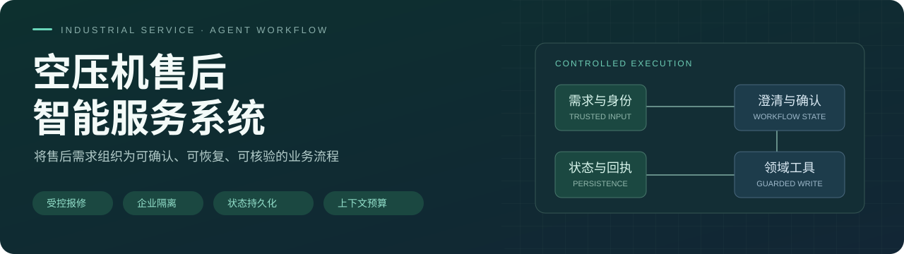
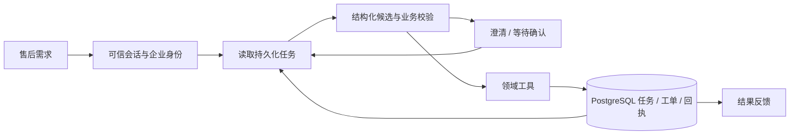
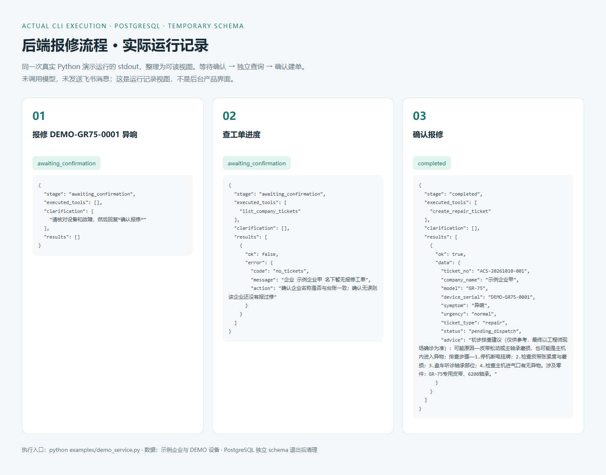

<p align="center">
  
</p>

# 空压机售后智能服务系统

[](https://github.com/siye566/fengyun-service-agent/actions/workflows/verify.yml)


[](LICENSE)

**面向设备售后业务的 Agent 工程项目：把报修、保养和进度查询组织为有状态、有权限边界、有确认门禁的业务流程。** 模型提供结构化候选，程序决定作用域、任务阶段与实际写操作，PostgreSQL 保存待处理任务、工单和事件回执。

[快速体验](#快速体验) · [业务流程](#业务流程) · [工程设计](docs/engineering-decisions.md) · [系统架构](docs/architecture.md) · [验证结果](docs/verification/README.md) · [交付范围](docs/roadmap.md)

## 项目概览

| 业务模块 | 工程实现 | 对应入口 |
| --- | --- | --- |
| 报修受理 | 缺字段澄清、设备校验、用户确认后建单 | [状态路由](backend/acs/service.py) |
| 企业与设备作用域 | 可信会话绑定、未绑定拒绝、设备/工单归属校验 | [身份与权限](backend/acs/identity.py) |
| 任务与回执 | 持久化待确认状态、稳定事件 ID、建单幂等键 | [PostgreSQL 数据结构](backend/acs/db.py) |
| 保养与进度 | 按设备查询保养、按企业/工单查询进度，独立查询保留报修 | [领域工具](backend/acs/tools.py) |
| 上下文装配 | 六段上下文、来源/摘要/哈希审计、预算告警与阻断 | [上下文服务](backend/acs/context.py) |
| 售后工作台 | 会话、任务卡片、工单、台账和保养计划 | [独立 React 应用](apps/service-console/README.md) |

公开版本使用示例企业、DEMO 设备与合成工单。领域引擎可真实读写 PostgreSQL；工作台当前为合成数据模式，尚未连接领域 API。Agent 执行层使用 Pi SDK（`@earendil-works/pi-coding-agent@0.84.2`），Host 管理会话与渠道，通过 [工具桥](docs/run-service-mode.md) 调用 Python 领域引擎。[数据库配置](docs/database.md)

## 业务流程

一条报修可以跨消息等待用户补充和确认；等待期间的工单查询不会覆盖原任务。

| 用户输入 | 程序处理 | 状态 / 写操作 |
| --- | --- | --- |
| “报修，机器异响” | 发现设备缺失，要求补充序列号 | 等待补充，不建单 |
| “DEMO-GR75-0001” | 校验企业、设备和故障信息 | 等待确认，不建单 |
| “查工单进度” | 独立只读查询，保留原报修 | 原任务继续等待 |
| “确认报修” | 验证可信本轮原文，调用建单工具 | 保存工单及回执 |
| 重复收到同一确认事件 | 返回已保存的事件结果 | 不重复建单 |



查看 [关键工程设计](docs/engineering-decisions.md)，了解确认门禁、身份绑定、查询保留任务和中断恢复的取舍；完整能力对照见 [实现地图](docs/implementation-map.md)。

## 售后工作台

**报修确认与待处理任务**：将对话中的设备、故障及待提交动作放在同一工作区，独立查询和挂起报修各自保留。


> 截图来自实际本地运行，保留合成数据与演示标识。前端按钮只操作组件内存，不代表后端建单成功；真实业务执行记录见下方。

<details>
<summary>设备台账与保养计划</summary>


</details>

<details>
<summary>真实 Python 业务执行：等待确认 → 独立查询 → 确认建单</summary>

以下图片将 `examples/demo_service.py` 的实际 stdout 整理为可读视图。程序读写 PostgreSQL 独立临时 schema，确认前不建单，查询后保留报修，确认后保存工单；未调用模型或发送渠道消息。此图是执行记录视图。



</details>

截图复现命令见 [截图说明](docs/screenshots/README.md)。

## 工程验证

| 验证层 | 已核验结果 | 证据 |
| --- | --- | --- |
| 业务规则回归 | 55 项 Python 测试通过 | [业务回归](backend/tests/test_service.py) · [迁移回归](backend/tests/test_postgres.py) · [验证记录](docs/validation.md) |
| 离线业务场景 | 16/16 通过，2026-10-10 复验 | [评估集](evals/service_cases.json) · [完整 JSON 报告](docs/verification/service-benchmark.json) |
| 桌面与移动端交互 | 12 项通过 | [交互测试](apps/service-console/tests/service.spec.ts) |
| Node → Python 工具桥 | 真实子进程集成通过 | [集成测试](vendor/miniclaw/tests/acs-service-bridge.test.ts) |
| 类型与构建 | 独立工作台、Pi Runner 及管理台构建通过 | [持续验证](https://github.com/siye566/fengyun-service-agent/actions/workflows/verify.yml) |

业务回归和评估于 2026-10-10 在真实 PostgreSQL 17.11 复验；界面基线为 2026-10-08。评估报告可按命令复现。CI 每次 push / PR 自动运行；状态以 Actions 为准。**16/16 是业务契约通过率，不是模型意图准确率或渠道端到端通过率。**

## 快速体验

### 售后工作台

需要 Node.js 20+。从根目录安装和启动，前端无需模型密钥或通用运行时依赖。

```bash
git clone https://github.com/siye566/fengyun-service-agent.git
cd fengyun-service-agent
npm ci
npm run dev
```

打开 `http://127.0.0.1:5173/`。当前工作台为合成数据模式，刷新后恢复初始数据；`npm run build` 检查类型并生成独立产物。

### 业务引擎与评估

需要 Python 3.10+ 和 PostgreSQL。先完成 [数据库配置](docs/database.md)：复制并编辑 `.env`，再运行 `docker compose up -d --wait postgres`；已有 PostgreSQL 可直接设置 `ACS_DATABASE_URL`。随后在仓库根目录运行：

```powershell
python -m venv .venv
.venv\Scripts\python.exe -m pip install -r requirements-dev.txt
.venv\Scripts\python.exe examples/demo_service.py
.venv\Scripts\python.exe -m pytest -q
.venv\Scripts\python.exe evals/run_service_eval.py --output evals/reports/service.json
```

macOS / Linux 将解释器路径替换为 `.venv/bin/python`。示例和场景评估使用独立 PostgreSQL schema，退出后清理；不会重置现有业务表。安装 Node.js 后也可运行 `npm run demo`、`npm test`、`npm run eval`；脚本优先使用根目录 `.venv`，支持 `ACS_AGENT_PYTHON`。

桌面与移动端回归：先 `npx playwright install chromium`，再 `npm run test:ui`。

### 真实模型与渠道接入

Host/Pi 需要绑定可信会话身份、配置模型及 Python 引擎路径。安装步骤、作用域要求和管理台启动见 [接入指南](docs/run-service-mode.md)。容器挂载和真实渠道收发需另行配置与验收。

## 系统架构与源码

```text
apps/service-console/   React 售后工作台与交互测试
backend/acs/            领域服务、状态路由、身份、上下文与 PostgreSQL
backend/tests/          业务规则及失败路径回归
evals/                  离线场景集与评估执行器
examples/               三轮报修链路入口
scripts/                统一运行命令
docs/                   架构、工程设计、截图、验证与交付范围
vendor/                 通用运行时及工具桥集成
```

[架构与阅读顺序](docs/architecture.md) · [关键工程设计](docs/engineering-decisions.md) · [目录迁移](docs/directory-migration.md)

## 实现范围

已实现：领域工具、企业作用域、受控报修、状态持久化、去重恢复、上下文预算、独立工作台及自动回归。

待接入：工作台业务 API、细分内部角色、自动提醒/派单，以及真实模型和渠道端到端验收。上下文预算以 UTF-8 bytes 计量。公开版本不附生产上线、经营收益或模型准确率主张；后续计划见 [交付范围](docs/roadmap.md)。

公开数据经过脱敏或合成处理，不包含客户材料、凭证、生产数据库或会话日志。代码来源和改动范围见 [NOTICE](NOTICE.md)，许可全文见 [LICENSE](LICENSE)。
