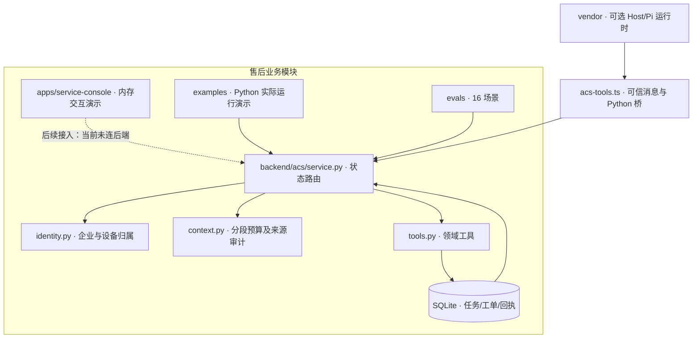

# 架构与源码阅读顺序

本项目将产品界面、领域引擎、评估样例与可选运行时分开。工作台独立构建，业务引擎独立测试；只有模型/渠道接入依赖通用运行时。

建议先读以下业务入口：

1. [演示](../examples/demo_service.py)：用三轮输入看确认门禁和查询并行。
2. [状态路由](../backend/acs/service.py)：字段澄清、候选校验、持久化任务和事件去重。
3. [身份](../backend/acs/identity.py) 与 [领域工具](../backend/acs/tools.py)：默认拒绝、设备/工单归属与写操作边界。
4. [上下文](../backend/acs/context.py)：阶段装配、来源哈希、预算、告警与阻断。
5. [工作台](../apps/service-console/src/features/service/AgentDesk.tsx)：演示任务、设备确认、独立查询和人工接手。
6. [测试](../backend/tests/test_service.py) 与 [评估集](../evals/service_cases.json)：能力主张对应可运行的失败路径。

`apps/service-console` 不加载通用 Host、登录、账单、终端和渠道依赖。其合成数据仅保存在组件内存，不提供生产租户鉴权。真实模型链路仍由 [Pi 接入](run-service-mode.md) 执行。

通用运行时、Pi 及第三方库的来源和许可见 [NOTICE](../NOTICE.md)。
